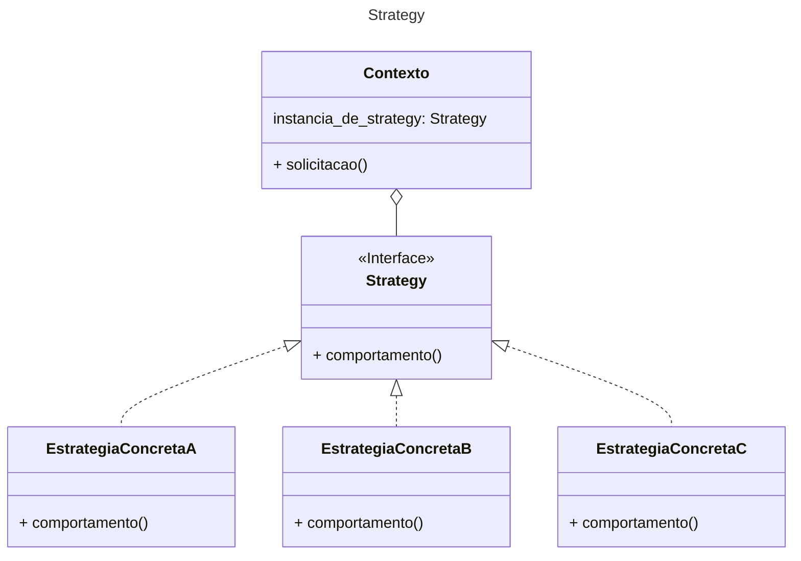
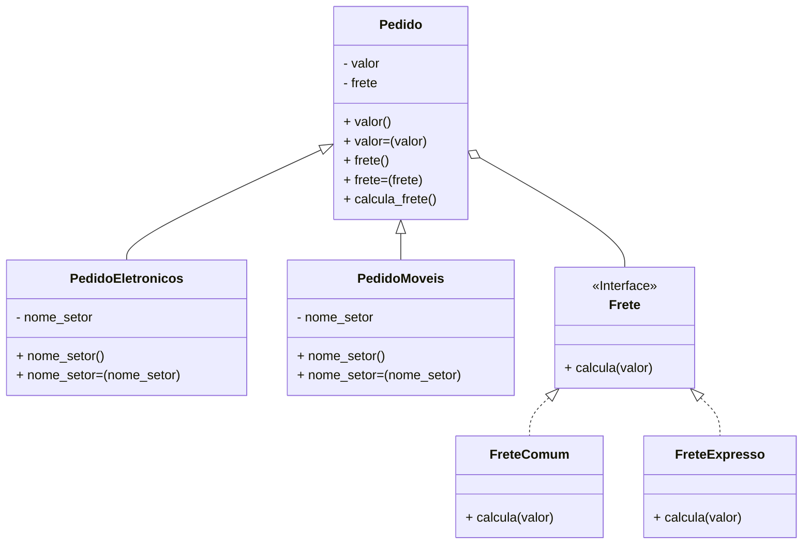

# Strategy

## Definição

O padrão de projeto Strategy define uma família de algoritmos, encapsula cada um deles e os torna intercambiáveis. O Strategy permite que o algoritmo varie independentemente dos clientes que o utilizam.


:camera: Diagrama de classes do padrão Strategy

## Exemplo de implementação


:camera: Implementação do diagrama de classes

```ruby
require './src/comportamentais/strategy/pedido.rb'
require './src/comportamentais/strategy/pedido_moveis.rb'
require './src/comportamentais/strategy/pedido_eletronicos.rb'
require './src/comportamentais/strategy/frete_comum.rb'
require './src/comportamentais/strategy/frete_expresso.rb'

frete_comum = FreteComum.new
frete_expresso = FreteExpresso.new

pedido_moveis = PedidoMoveis.new
pedido_moveis.valor = 100

pedido_moveis.frete = frete_comum
pedido_moveis.calcula_frete
# 5.0

pedido_moveis.frete = frete_expresso
pedido_moveis.calcula_frete
# 10.0

pedido_eletronicos = PedidoEletronicos.new
pedido_eletronicos.valor = 100

pedido_eletronicos.frete = frete_comum
pedido_eletronicos.calcula_frete
# 5.0

pedido_eletronicos.frete = frete_expresso
pedido_eletronicos.calcula_frete
# 10.0
```
:camera: Testes da implementação
